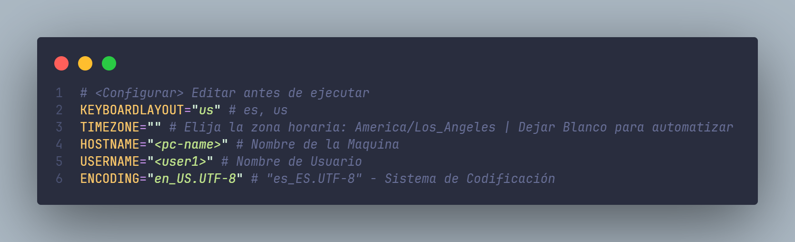

<div align="center">
 
<h3>
 [Script] de instalación para Arch-Linux
</h3>
<p>Scripts creados para la instalación automatizada de Arch + Recursos adicionales.</p>
</div>


<p></p> 
<div align="center">


</div>

> [!TIP]
> El script de instalacion esta basado  en la guia oficial [**wiki.archlinux.org**](https://wiki.archlinux.org/title/Installation_guide)).

## Descarga de ISO y grabado en USB: 

Descargar desde: https://archlinux.org/download/
- Boot - Linux en USB:
```bash
# Ruta del ISO: /home/ioksc/download/archlinux.iso
# Dispositivo USB: sdc --> /dev/sdc
sudo dd bs=4M if=/home/ioksc/download/archlinux.iso of=/dev/sdc status=progress && sync
```
- Boot- Windows: https://www.ventoy.net/

## PASOS PREVIOS:

### Comprobar el modo de arranque para UEFI
```shell 
ls /sys/firmware/efi/efivars
# Listar 
localectl list-keymaps
# ejemplo de Establecer el layout del teclado a (es) - Español
loadkeys es
# Sincronizamos
timedatectl set-ntp true
``` 
### Comprobar red y conexión a Wifi

```shell  
# aqui reemplazar por su interfaz de red (en mi caso "wlan0")
iwlist wlan0 scan
# Nos Conectamos con el siguiente comando:
iwctl --passphrase 'aqui-tu-pass' station wlan0 connect 'aqui-el-nombre-de-red-wifi'
# o: iwctl --> station wlan0 scan --> station wlan0 connect 'SSID-name'
```
### Esquema de Particiónes
```shell

#   Type     Value (Hexcode)             Size       
# -----------------------------------------------
# 1 Boot 'EFI System (EF00)'        --> +550M   
# 2 Swap 'Linux Swap (8200)'        --> +2G     
# 3 Root 'Linux-x86-64 / (8304)'    --> +20G    
# 4 Home 'Linux Home (8302)'        --> +100G  

# Mediante fdisk,gdisk o cgdisk puedes crear las particiones.
cgdisk /dev/sda

```
### Descargar paquetes necesarios
```bash
pacman -Sy
pacman -S git gum
```


## 🚀 Instalación de Arch-Linux Script

1. Clonar este repositorio.

```bash
git clone https://github.com/ioksc/io-arch.git
```

2. Cambiar de Directorio io-arch


```bash
cd io-arch/
```

- dar permisos de ejecucion al archivo y ejecutar el script:

```bash
chmod +x install.sh post-install.sh

```
3. Configurar el script post-install


4. Ejecutar el Script  🚀:

```bash
./install.sh
```


### 🤝 Contributing

<a href="https://github.com/ioksc/io-arch/graphs/contributors">
  
</a>


## 🛠️ Enlaces Adicionales:

- [**Wiki Arch**](https://wiki.archlinux.org/title/Installation_guide) - Guía Oficial de Instalación.
- [**Modern Unix App**](https://github.com/ibraheemdev/modern-unix) - Alternativas modernas a comandos comunes.
- [**Dotfiles (prasanthrangan)**](https://github.com/prasanthrangan/hyprdots) - Dotfiles para configuracion de Hyprland.


## 🔑 License

[MIT](#) - Created by [**ioksc**](https://github.com/ioksc).

